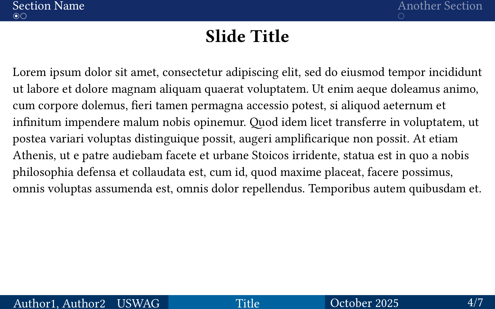

# Pepentation

*Simple slides for your univesitie's presentation*

Features:
 - Customisable colorscheme
 - Progress tracker (LaTeX beamer inspired)
 - Headings for slide creation and sectioning


| Title Slide | Table of Contents | Section Slide | Main Slide|
| - | - | - | - |
|  |  |  |  |

 ## Setup

 Install pepentation by cloning it to folder `{data-dir}/typst/packages/local/pepentation/0.0.1` where `{data-dir}` is

- `$XDG_DATA_HOME` or `~/.local/share` on Linux
- `~/Library/Application Support` on macOS
- `%APPDATA%` on Windows

After that the package can be imported with `#import "@local/pepentation:0.0.1": *`. 

## Usage

```typst
#import "@local/pepentation:0.0.1": *
#show: setup_presentation.with(
  title-long: "Long version of the title",
  authors-long: ("LastName1 FirstName1", "LastName2 FirstName2"),
  institute-long: "University of SWAG",
  title-short: "Title",
  authors-short: ("Author1", "Author2"),
  institute-short: "USWAG",
  date: "October 2025",
)
...
```

Then, insert your content.

- Level-one headings corresponds to new sections.
- Level-two headings corresponds to new slides.
 - Empty Level-two headings create new empty slide and does not apear in table of contents

```typst
...

= First Section

== First Slide
#lorem(20)

// Second slide with no title
==
#lorem(20)
```

## Additional functionality

Provides blocks to highlight some informative part of the presentation:
- ```#defenition[content]```
- ```#warning[content]```
- ```#remark[content]```
- ```#hint[content]```

## Options

All available Options to initialize the template with

| Keyword                 | Description                                                    | Default          |
| ----------------------- | -------------------------------------------------------------- | ---------------- |
| *title-slide*           | Map of all title slide info                                    | `map`            |
| *title-slide.enable*    | Wheather to show title slide or not                            | `false`          |
| *title-slide.title*     | Full title displayed on title page                             | `none`           |
| *title-slide.authors*   | Full names of authors displayed on title page                  | `()`             |
| *title-slide.institute* | Full names of institute displayed on title page                | `none`           |
| *title-long*            | Full title displayed on title page                             | `none`           |
| *footer*                | Map of all footer info                                         | `map`            |
| *footer.enable*         | Wheather to show footer or not                                 | `false`          |
| *footer.title*          | Short title displayed in footer                                | `none`           |
| *footer.authors*        | Short names of authors displayed in footer                     | `()`             |
| *footer.institute*      | Short names of institute displayed in footer                   | `none`           |
| *footer.date*           | Date displayed in footer                                       | `Today`          |
| *theme*                 | Map of all theme info                                          | `map`            |
| *theme.primary*         | Primary color of presentation                                  | `rgb("#003365")` |
| *theme.secondary*       | Secondary color of presentation                                | `rgb("#00649F")` |
| *theme.main-text*       | Color of content's text.                                       | `rgb("#00649F")` |
| *theme.sub-text*        | Color of text used in places like header, footer, etc.         | `rgb("#00649F")` |
| *theme.background*      | Background color of presentation                               | `rgb("#00649F")` |
| *table-of-content*      | Wheather to show table of content or not                       | `false`          |
| *header*                | Wheather to show header or not                                 | `true`           |
| *locale*                | Language of presentation. Only "EN" and "RU" supported for now | `"EN"`           |
| *height*                | Height of a slide. Most likely you do not need to touch that   | `12cm`           |
